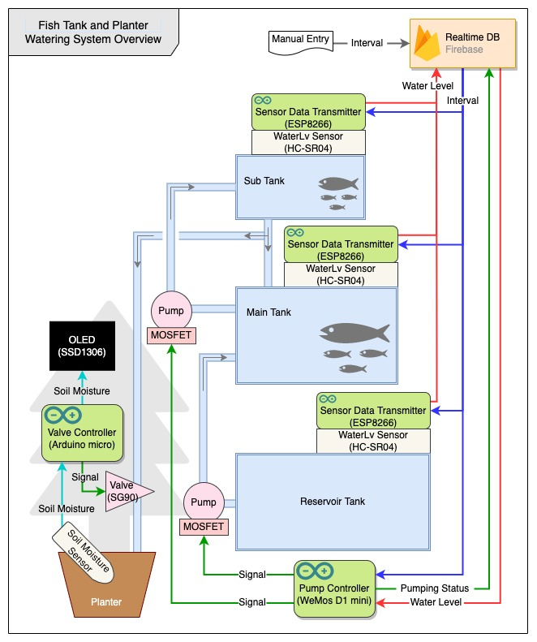

<h2 align="center"> Aquarium and Plant Watering Automator</h1>

### Background
#### Tanks
* Two fish tanks -- main and sub -- to be managed.
* Water circulates between main and sub tanks by:-
	* main -> sub: pumping up.
	* sub -> main: dripping with syphone as sub tank is located above the main tank.
* One reservoir tank to store fresh water as there is no access to water close by.
* Reservoir tank supplies water only to the main tank when needed.
#### Plant
* One plant (bottle tree; approx. 2m high) to be managed.
* Fish tank water is supplied when needed, expecting better nutritional dissolution for the plant.
#### What to Monitor
* Fish tanks: water level of each tank
* Plant: soil moisture
### System Overview

